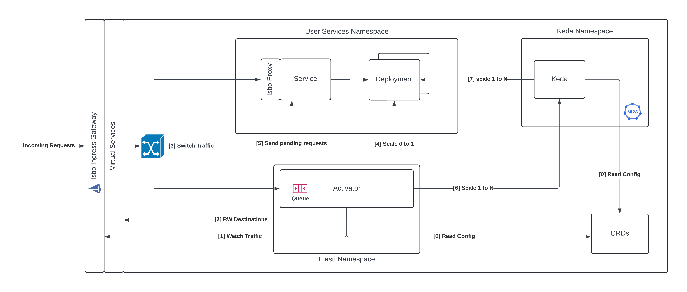

# Elasti-scale-to-zero

Elasti is a tool for auto-scaling Kubernetes services based on incoming requests. It pulls the number of requests received on the istio-gateway, scales services up when the requests increase and scales services down when they decrease. If there are no requests, it scales them down to 0. 

The name Elasti comes from a superhero from DC Comics, which can grow large and small like this tool. 

# Problem Statement

# Challenges 

- Activator Switching Traffic using Knative Code
- Identify services based on the label using custom CRDs
- Activator scaling 0 -> 1
- KEDA and Activator Communication

### Scaling 0 to N can happen from keda? Activator doesn’t need to do that
- We are using activator to make sure 0 to 1 goes through faster

### A controller will be separate from the activator and will act to switch traffic
- Why?
  - Will be difficult to scale to multiple replicas
- We can achieve certain single-threaded functionality via locks etc in Activator now, but will eventually separate it out in a controller. - RT
- This is decided only to save time of development.  - RT

### What happens for east-west traffic?
- Open question?
- We will answer this as we go, however, the first solution which pops is to identify the outside and internal traffic, and handle them separately. -RT 

### Instead of doing a label based thing, can the controller act whenever a service is scaled down to 0? There is nothing we save from excluding few of the services
- We want to select a subset. We can use * to select all the service

| Switching should happen a bit before the service is scaled to 0 - probably just when the pod is getting the terminating signal - and we have the 30 seconds drain period from Kubernetes. 

### What is the cron in CRDs? The informer takes care of letting the controller know of changes automatically
- No cron in CRDs, we will depend on the informer only, but a handler will be introduced for those changes. Cron was used to represent the handler, I will correct that. - RT 

### How does the activator scale? What should be the scaling criteria?
- Will be covered Testing phase
- We will decide the criteria as we go, it can be memory or CPU, or open connections, or queue size etc. - RT

# Components

## Activator
 
- Read labels to identify watched services.
- Get the Destination to those services, to watch the traffic to those routes. 
- Track request count to those destinations.
  - If 0 req -> Request KEDA to scale deployment to 0.
  - If req > 0 but < N -> Scale service directly from deployment 0 to 1.
  - If req > N -> Request KEDA to scale deployment N1.
- Handle CRDs to get the latest configurations.
  - How long to wait for requests to remain 0.
  - How many instances to create when a request comes in after a long time.
  - How long to hold the request in the activator, timeout. 
- Create a queue for the requests. 
- APIs to take the incoming request, and the kind of request we can take in. 
- Switch the destination in VirtualService to the point between Activator and the actual service. Utilise Knative code to make the activator behave like a proxy. 

| We can later decide to move out some responsibilities from Activator to Controller, like watching the traffic and switching the traffic.  

## CRDs

- Create ScaledObjects CRD to register the activator as a Scalar.
- Automatically configure ScaledJobs CRD to match the Activator config, like the number of pods etc, which will overwrite the KEDA configuration for that service. 
- CRDs to configure Elasti, and identify deployments, and their rules. 

